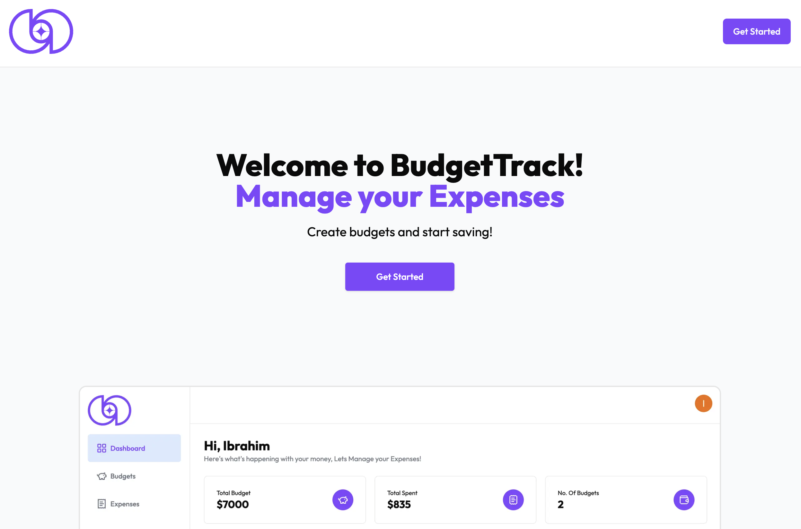
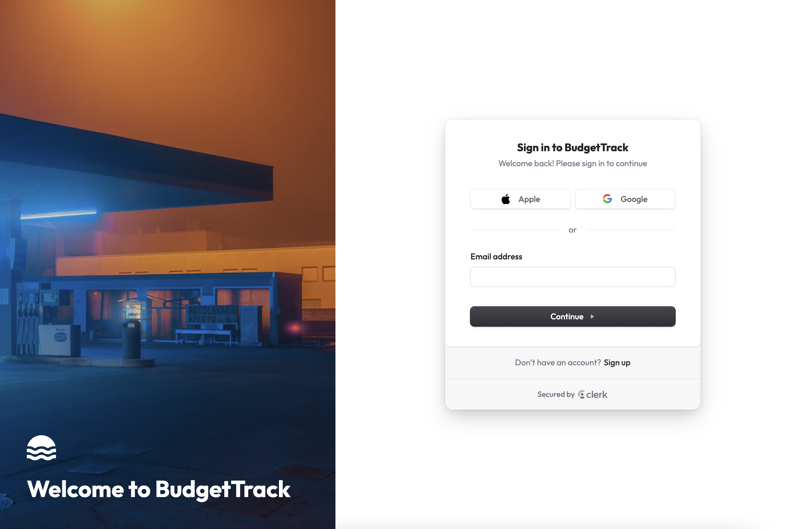
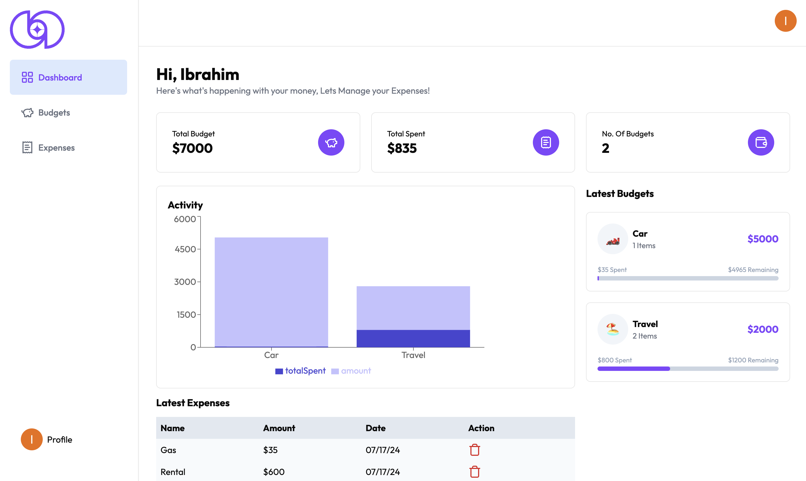
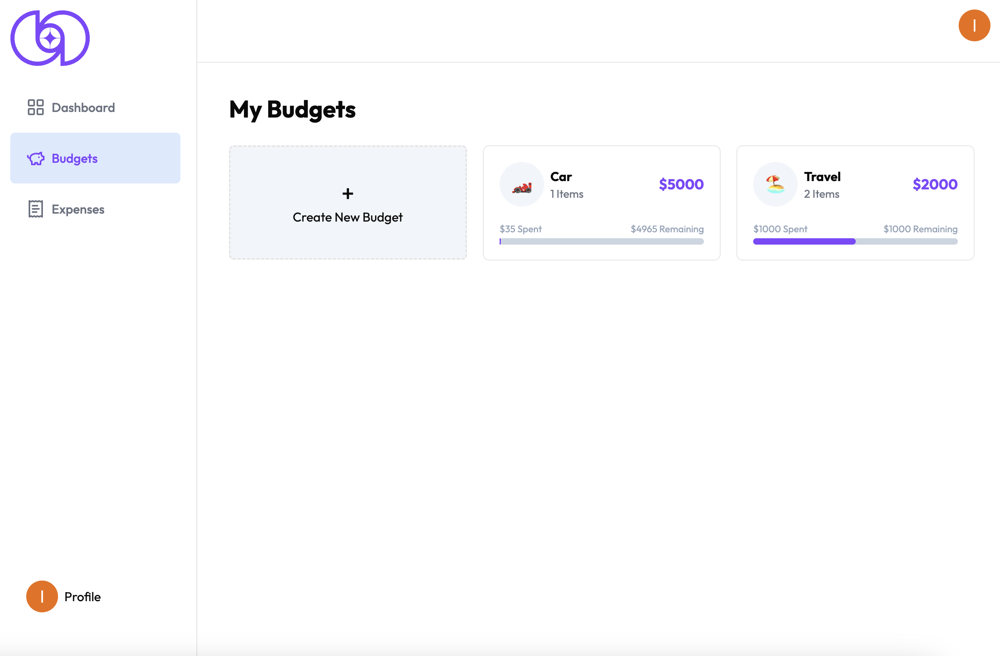
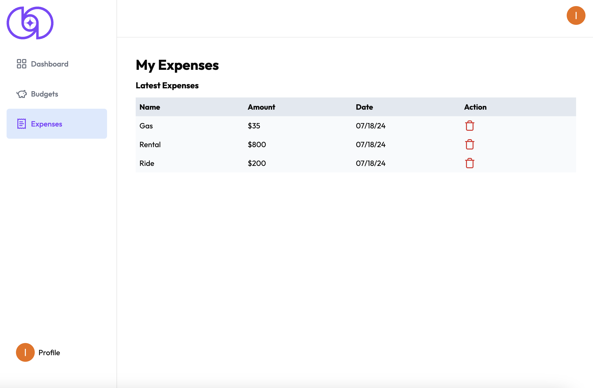

# BudgetTrack
## Web App: [budgettrack.xyz](https://www.budgettrack.xyz/)

## Table of Contents
- [About the App](#about-the-app)
- [Screenshots](#screenshots)
- [Tech Stack](#tech-stack)
- [Setup](#setup)
- [Status](#status)

### About the App
BudgetTrack is a budgeting app that allows users to keep track of and visualize their budgets and expenses. User authentication is handled with Clerk. Information is stored in a Neon PostgreSQL database and queried with Drizzle ORM.

### Screenshots






### Tech Stack


### Setup
If you'd like to replicate the site on your local system you should: <br>

1. Clone the repository onto your system. 
2. Make sure you have either npm, yarn, pnpm, or bun installed.
3. Run the development server:
```bash
npm run dev
# or
yarn dev
# or
pnpm dev
# or
bun dev
```
4. Open [http://localhost:3000](http://localhost:3000) with your browser to see the result.

### Status
**Completed**
